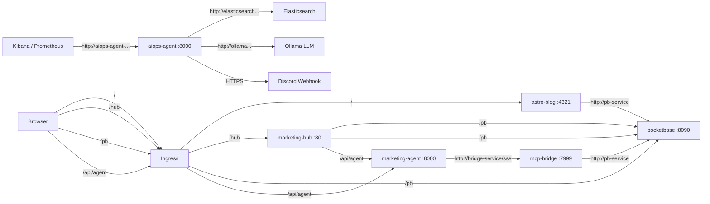

# Kiện toàn hệ thống Infrastructure TMCP

## Background

Hệ thống **tmcp-marketing** hiện đang chạy trên Kubernetes (macOS server + Argo CD) với các service:

| Service | Image | Port | Status |
|---------|-------|------|--------|
| PocketBase | `lupca/tmcp-dashboard:latest` | 8090 | ✅ Running |
| Astro Blog | `lupca/tmcp-blog:latest` | 4321 | ✅ Running |
| Marketing Agent | `lupca/tmcp-agents:latest` | 8000 | ⚠️ Không kết nối được MCP Bridge |
| MCP Bridge | *(chưa deploy)* | 7999 | ❌ Missing |
| Marketing Hub | *(chưa có)* | 5173 | ❌ Missing |

### Vấn đề phát hiện

1. **MCP Bridge chưa được deploy** → Agent default `MCP_SERVER_URL=http://localhost:7999` → không gọi được tools
2. **Agent thiếu env `MCP_SERVER_URL`** → không trỏ tới Bridge service trong cluster
3. **Marketing Hub chưa có** trong cluster (chưa có Dockerfile, chưa có manifest)
4. **Ingress thiếu routes** cho Agent API và Marketing Hub

### Target Architecture



---

## Proposed Changes

### AIOps Agent Deployment (Internal SRE Tool)

#### [NEW] [aiops-agent.yaml](aiops-agent.yaml)

Deployment + Service cho `tmcp-aiops-agent`:
- Image: `lupca/tmcp-aiops-agent:latest`
- Port: 8000
- Env: Trỏ tới Elasticsearch và Ollama.
- Secret: Lấy `DISCORD_WEBHOOK_URL` thông qua ExternalSecrets.
- Service: `aiops-agent-service` → port 80 → targetPort 8000

> [!IMPORTANT]
> **Internal Service Only**: AIOps Agent hoàn toàn **không** được cấu hình trong `ingress.yaml`. Nó là một service nội bộ. Kibana và Prometheus (hoặc các SRE trigger thủ công) sẽ gọi trực tiếp webhook nội bộ thông qua URL: `http://aiops-agent-service.<namespace>.svc.cluster.local:80/api/webhook/alert`. Quyết định này giúp loại bỏ rủi ro bị tấn công DDoS/Spam webhook từ bên ngoài Internet.

---

### MCP Bridge Deployment

#### [NEW] [bridge.yaml](bridge.yaml)

Deployment + Service cho `tmcp-m-bridge`:
- Image: `lupca/tmcp-m-bridge:latest`
- Port: 7999
- Env: `POCKETBASE_URL=http://pb-service`, credentials
- Service: `bridge-service` → port 80 → targetPort 7999

---

### Fix Agent connectivity

#### [MODIFY] [agent.yaml](agent.yaml)

Thêm env vars:
```diff
 env:
 - name: PB_URL
   value: "http://pb-service"
+- name: MCP_SERVER_URL
+  value: "http://bridge-service/sse"
+- name: POCKETBASE_USER
+  value: "admin@admin.com"
+- name: POCKETBASE_PASSWORD
+  value: "123qweasdzxc"
```

---

### Add Marketing Hub

#### [NEW] Dockerfile (cho tmcp-marketing-hub)

Multi-stage build:
1. Stage 1: `node:20-alpine` → `npm ci && npm run build`
2. Stage 2: `nginx:alpine` → serve static files from `/usr/share/nginx/html`
3. Custom `nginx.conf` to handle SPA routing + env var injection

#### [NEW] [marketing-hub.yaml](marketing-hub.yaml)

Deployment + Service:
- Image: `lupca/tmcp-marketing-hub:latest`
- Port: 80 (nginx)
- Service: `hub-service` → port 80 → targetPort 80

---

### Update Ingress

#### [MODIFY] [ingress.yaml](ingress.yaml)

> [!IMPORTANT]
> Marketing Hub là SPA, gọi API thông qua **relative paths** (`/pb/...` và `/api/agent/...`) → Ingress proxy tới các backend service. Điều này giúp tránh CORS issues hoàn toàn.

Thêm routes (Sử dụng Traefik IngressRoute cho StripPrefix):
- Path `/pb` → pb-service
- Path `/api/agent` → agent-service
- Path `/hub` → hub-service
- Path `/` → blog-service

---

## Verification Plan

### Manual Verification (sau khi push code + Argo CD sync)

> [!CAUTION]
> **HashiCorp Vault Unseal Process (CRITICAL)**
> 1. Bật tính năng K8s Auth trên Vault
> vault auth enable kubernetes
>   
> 2. Cấu hình để Vault biết nó đang nằm trong cụm K8s nào
> vault write auth/kubernetes/config \
>    kubernetes_host="https://$KUBERNETES_PORT_443_TCP_ADDR:443"

> 3. Tạo Role tên là "eso" (khớp với YAML của AI) và cho phép SA "external-secrets" được phép đọc nhánh "secret/data/tmcp/*"
> vault write auth/kubernetes/role/eso \
>    bound_service_account_names=external-secrets \
>    bound_service_account_namespaces=external-secrets \
>    policies=eso-policy \
>    ttl=1h
> Vì chúng ta sử dụng bare-metal K3s và không dùng Cloud KMS, Vault sẽ chuyển sang trạng thái **Sealed** mỗi khi Pod khởi động lại hoặc Node reboot. 
> **Bắt buộc** phải chạy lệnh unseal bằng tay mỗi lần restart:
> ```bash
> kubectl exec -it -n vault vault-0 -- vault operator unseal <UNSEAL_KEY_1>
> kubectl exec -it -n vault vault-0 -- vault operator unseal <UNSEAL_KEY_2>
> kubectl exec -it -n vault vault-0 -- vault operator unseal <UNSEAL_KEY_3>
> ```
> *(Thay thế `<UNSEAL_KEY_X>` bằng các key nhận được lúc chạy `vault operator init` lần đầu)*

> [!TIP]
> **Thêm/Sửa Mật Khẩu với Vault & ESO**
> 1. Lưu secret vào Vault: `kubectl exec -it -n vault vault-0 -- vault kv put secret/tmcp/agent POCKETBASE_PASSWORD="YOUR_PASSWORD"`
> 2. Lệnh tạo secret quản lý Discord cho AIOps: `kubectl exec -it -n vault vault-0 -- vault kv put secret/tmcp/aiops-agent DISCORD_WEBHOOK_URL="https://discord.com/api/webhooks/..."`
> 3. Khai báo `ExternalSecret` trong GitOps YAML của app tương ứng (ví dụ: `agent.yaml`, `aiops-agent.yaml`)
> 4. ESO sẽ tự động lấy secret từ Vault và tạo thành K8s Secret trong cluster. Git repostiory sẽ hoàn toàn không chứa plaintext password.

1. **Kiểm tra tất cả pods running**: `kubectl get pods` - tất cả pods phải ở trạng thái Running
2. **Kiểm tra services**: `kubectl get svc` - phải có: `pb-service`, `blog-service`, `agent-service`, `bridge-service`, `hub-service`
3. **Kiểm tra Ingress**: `kubectl get ingress` (hoặc `kubectl get ingressroute`) - phải có routes cho `/`, `/pb`, `/hub`, `/api/agent`
4. **Test PocketBase**: Truy cập `http://<server-ip>/pb/_/` - phải mở được admin UI
5. **Test Blog**: Truy cập `http://<server-ip>/` - phải load được blog
6. **Test Marketing Hub**: Truy cập `http://<server-ip>/hub` - phải load được SPA
7. **Test Agent API**: `curl http://<server-ip>/api/agent/health` - phải trả về `{"status":"ok"}`
8. **Test Agent ↔ Bridge**: Gửi chat message từ Marketing Hub → xem Agent có gọi được MCP tools không
