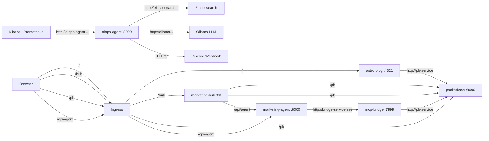

# Kiện toàn hệ thống Infrastructure TMCP

## Background

Hệ thống **tmcp-marketing** hiện đang chạy trên Kubernetes (macOS server + Argo CD) với các service:

| Service | Image | Port | Status |
|---------|-------|------|--------|
| PocketBase | `lupca/tmcp-dashboard:latest` | 8090 | ✅ Running |
| Astro Blog | `lupca/tmcp-blog:latest` | 4321 | ✅ Running |
| Marketing Agent | `lupca/tmcp-agents:latest` | 8000 | ⚠️ Không kết nối được MCP Bridge |
| MCP Bridge | *(chưa deploy)* | 7999 | ❌ Missing |
| Marketing Hub | *(chưa có)* | 5173 | ❌ Missing |

### Vấn đề phát hiện

1. **MCP Bridge chưa được deploy** → Agent default `MCP_SERVER_URL=http://localhost:7999` → không gọi được tools
2. **Agent thiếu env `MCP_SERVER_URL`** → không trỏ tới Bridge service trong cluster
3. **Marketing Hub chưa có** trong cluster (chưa có Dockerfile, chưa có manifest)
4. **Ingress thiếu routes** cho Agent API và Marketing Hub

### Target Architecture



---

## Proposed Changes

### AIOps Agent Deployment (Internal SRE Tool)

#### [NEW] [aiops-agent.yaml](aiops-agent.yaml)

Deployment + Service cho `tmcp-aiops-agent`:
- Image: `lupca/tmcp-aiops-agent:latest`
- Port: 8000
- Env: Trỏ tới Elasticsearch và Ollama.
- Secret: Lấy `DISCORD_WEBHOOK_URL` thông qua ExternalSecrets.
- Service: `aiops-agent-service` → port 80 → targetPort 8000

> [!IMPORTANT]
> **Internal Service Only**: AIOps Agent hoàn toàn **không** được cấu hình trong `ingress.yaml`. Nó là một service nội bộ. Kibana và Prometheus (hoặc các SRE trigger thủ công) sẽ gọi trực tiếp webhook nội bộ thông qua URL: `http://aiops-agent-service.<namespace>.svc.cluster.local:80/api/webhook/alert`. Quyết định này giúp loại bỏ rủi ro bị tấn công DDoS/Spam webhook từ bên ngoài Internet.

---

### MCP Bridge Deployment

#### [NEW] [bridge.yaml](bridge.yaml)

Deployment + Service cho `tmcp-m-bridge`:
- Image: `lupca/tmcp-m-bridge:latest`
- Port: 7999
- Env: `POCKETBASE_URL=http://pb-service`, credentials
- Service: `bridge-service` → port 80 → targetPort 7999

---

### Fix Agent connectivity

#### [MODIFY] [agent.yaml](agent.yaml)

Thêm env vars:
```diff
 env:
 - name: PB_URL
   value: "http://pb-service"
+- name: MCP_SERVER_URL
+  value: "http://bridge-service/sse"
+- name: POCKETBASE_USER
+  value: "admin@admin.com"
+- name: POCKETBASE_PASSWORD
+  value: "123qweasdzxc"
```

---

### Add Marketing Hub

#### [NEW] Dockerfile (cho tmcp-marketing-hub)

Multi-stage build:
1. Stage 1: `node:20-alpine` → `npm ci && npm run build`
2. Stage 2: `nginx:alpine` → serve static files from `/usr/share/nginx/html`
3. Custom `nginx.conf` to handle SPA routing + env var injection

#### [NEW] [marketing-hub.yaml](marketing-hub.yaml)

Deployment + Service:
- Image: `lupca/tmcp-marketing-hub:latest`
- Port: 80 (nginx)
- Service: `hub-service` → port 80 → targetPort 80

---

### Update Ingress

#### [MODIFY] [ingress.yaml](ingress.yaml)

> [!IMPORTANT]
> Marketing Hub là SPA, gọi API thông qua **relative paths** (`/pb/...` và `/api/agent/...`) → Ingress proxy tới các backend service. Điều này giúp tránh CORS issues hoàn toàn.

Thêm routes (Sử dụng Traefik IngressRoute cho StripPrefix):
- Path `/pb` → pb-service
- Path `/api/agent` → agent-service
- Path `/hub` → hub-service
- Path `/` → blog-service

---

## Standard Operating Procedures (SOP) & Troubleshooting

Dưới đây là các thủ tục quan trọng nhất rút ra từ quá trình vận hành thực tế Cụm K3s + ArgoCD + Vault:

### 1. Vấn đề "Con gà - Quả trứng" khi Sync ArgoCD lần đầu
Khi deploy toàn bộ thư mục `tmcp-gitops` lên một cluster mới tinh, ArgoCD có thể báo lỗi:
> `Resource not found in cluster: argoproj.io/v1alpha1/Application:external-secrets`

**Nguyên nhân:** Kubernetes từ chối Dry-run vì chưa hiểu `ExternalSecret` là gì (do App `external-secrets` chứa định nghĩa CRD chưa được cài đặt).
**Cách xử lý:** 
Chạy Sync theo 2 giai đoạn thủ công trên giao diện ArgoCD:
- **Giai đoạn 1 (Infra):** Chỉ tick chọn cài đặt `eso-application.yaml` và `vault-application.yaml`. Chờ 2 App này xanh lá.
- **Giai đoạn 2 (Workloads):** Bấm Sync lại và tick cài đặt tất cả các file còn lại (`agent.yaml`, `aiops-agent.yaml`,...). Lúc này Sync-waves mới phát huy tác dụng.

### 2. Vault ProvisioningFailed (Lỗi StorageClass)
> `ProvisioningFailed: storageclass.storage.k8s.io "longhorn" not found`

**Nguyên nhân:** Cụm K3s bare-metal mặc định dùng `local-path`, không có cài `longhorn`.
**Cách xử lý:** Không truyền cứng (`hardcode`) tham số `storageClass` vào file `vault-application.yaml`. Xóa trực tiếp StatefulSet bị lỗi bằng lệnh `kubectl delete statefulset vault -n vault`, sau đó ArgoCD sẽ tự động tái tạo bằng StorageClass mặc định.

### 3. Khởi tạo và Mở Khoá Vault (Vault Init & Unseal)
Mặc định khi cài xong, Vault sẽ báo lỗi `Readiness probe failed (Initialized false, Sealed true)`.

**Bước 1: Khởi tạo (Chỉ làm 1 lần duy nhất trong đời hệ thống)**
```bash
kubectl exec -it -n vault vault-0 -- vault operator init
```
*Lưu ngay 5 mã "Unseal Key" và 1 mã "Initial Root Token" ra nơi an toàn. Mất mã này là mất vĩnh viễn quyền truy cập.*

**Bước 2: Hệ thống Unseal (Sau mỗi lần Pod/Server khởi động lại)**
Do không có Cloud KMS, bạn phải unseal bằng tay bằng cách chạy lệnh này 3 lượt, mỗi lượt nạp 1 Key bất kỳ (cần 3/5 key):
```bash
kubectl exec -it -n vault vault-0 -- vault operator unseal
# Dán Key vào rổi Enter
```
Khi chạy `vault status`, thấy `Initialized: true` và `Sealed: false` là thành công.

### 4. Bật xác thực Kubernetes Auth (Bắt buộc cho External Secrets)
Dù đã mở khoá, ExternalSecret Operator (ESO) vẫn sẽ báo `unable to log in with Kubernetes auth: Error making API request`. Bạn phải báo cho Vault biết cách uỷ quyền cho K8s.

**Thực hiện 5 lệnh sau bằng quyền Root:**
```bash
# 1. Đăng nhập quyền root (Dán Initial Root Token thay vào chữ hvs...)
sudo kubectl exec -it -n vault vault-0 -- vault login hvs.xxxxx...

# 2. Bật Engine chứa Secret (KV phiên bản 2) - Nơi chứa mật khẩu của ta
sudo kubectl exec -it -n vault vault-0 -- vault secrets enable -path=secret kv-v2

# 3. Kích hoạt tính năng K8s Auth
sudo kubectl exec -it -n vault vault-0 -- vault auth enable kubernetes

# 4. Lưu lại toạ độ API của Cluster K8s hiện tại
sudo kubectl exec -it -n vault vault-0 -- sh -c 'vault write auth/kubernetes/config kubernetes_host="https://$KUBERNETES_PORT_443_TCP_ADDR:443"'

# 5. Tạo Policy và uỷ quyền cho ServiceAccount "external-secrets" được đọc data
sudo kubectl exec -it -n vault vault-0 -- sh -c "echo 'path \"secret/data/tmcp/*\" { capabilities = [\"read\"] }' | vault policy write eso-policy -"
sudo kubectl exec -it -n vault vault-0 -- vault write auth/kubernetes/role/eso bound_service_account_names=external-secrets bound_service_account_namespaces=external-secrets policies=eso-policy ttl=1h
```

### 5. Quản trị Mật khẩu (Secret Management)
Nếu Pod báo chờ `CreateContainerConfigError`, nghĩa là ESO không móc được Secret từ Vault (do bạn chưa tạo key). 

**Cách tạo / cập nhật mật khẩu:**
```bash
# Sửa/Tạo mật khẩu cho PocketBase (Agent)
kubectl exec -it -n vault vault-0 -- vault kv put secret/tmcp/agent POCKETBASE_PASSWORD="YOUR_PASSWORD"

# Sửa/Tạo mật khẩu Discord (AIOps Agent)
kubectl exec -it -n vault vault-0 -- vault kv put secret/tmcp/aiops-agent DISCORD_WEBHOOK_URL="https://discord.com/api/webhooks/xxxx/yyyy"
```
*Sau khi chạy lệnh, vào ArgoCD ấn Refresh và Sync App `tmcp-gitops` để ESO cập nhật ngay lập tức.*

---

## Testing Workflow
1. **Kiểm tra sức khoẻ**: `kubectl get pods -A` (Tất cả phải Running)
2. **Kiểm tra Ingress Routes**: Truy cập `/pb/_/` (PocketBase), `/hub` (Marketing SPA), `/api/agent/health`.
3. **Trigger AIOps Local**: Gửi HTTP POST tới `http://aiops-agent-service.default.svc.cluster.local/api/webhook/alert` từ bên trong cụm để test luồng Discord webhook.
