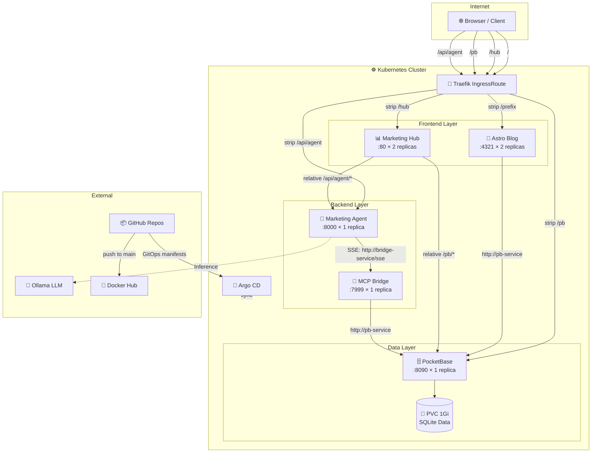

# 📐 TMCP GitOps – Tài liệu Kiến trúc Hệ thống

> **Phiên bản:** 1.0  
> **Cập nhật lần cuối:** 2026-02-15  
> **Tác giả:** TMCP Engineering Team

---

## Mục lục

1. [Tổng quan Hệ thống](#1-tổng-quan-hệ-thống)
2. [Kiến trúc Tổng thể](#2-kiến-trúc-tổng-thể)
3. [Chi tiết các Microservices](#3-chi-tiết-các-microservices)
4. [Networking & Ingress](#4-networking--ingress)
5. [CI/CD Pipeline](#5-cicd-pipeline)
6. [GitOps Workflow với Argo CD](#6-gitops-workflow-với-argo-cd)
7. [Quản lý Dữ liệu & Persistent Storage](#7-quản-lý-dữ-liệu--persistent-storage)
8. [Giao tiếp giữa các Service](#8-giao-tiếp-giữa-các-service)
9. [Bảo mật](#9-bảo-mật)
10. [Scaling & Availability](#10-scaling--availability)
11. [Directory Structure](#11-directory-structure)
12. [Phụ lục](#12-phụ-lục)

---

## 1. Tổng quan Hệ thống

### 1.1. Giới thiệu

**TMCP (The Marketing Campaign Platform)** là một nền tảng marketing tự động hoá, được xây dựng theo kiến trúc **microservices** và triển khai trên **Kubernetes** với mô hình **GitOps**. Hệ thống tích hợp AI Agent (LLM-powered) để hỗ trợ lên chiến lược, nghiên cứu thị trường, tạo nội dung và quản lý chiến dịch marketing.

### 1.2. Mục tiêu thiết kế

| Mục tiêu | Mô tả |
|-----------|--------|
| **Declarative Infrastructure** | Toàn bộ infrastructure được khai báo dưới dạng YAML manifests trong Git |
| **GitOps-driven** | Mọi thay đổi infrastructure đều thông qua Git → Argo CD tự động sync |
| **Microservices** | Mỗi service là 1 repo độc lập, build & deploy independently |
| **AI-Native** | Tích hợp AI Agent với MCP (Model Context Protocol) để tương tác dữ liệu |
| **Reproducible** | Có thể tái tạo toàn bộ cluster từ Git repository |

### 1.3. Technology Stack

| Layer | Technology |
|-------|-----------|
| **Orchestration** | Kubernetes (K3s trên macOS server) |
| **GitOps Controller** | Argo CD |
| **Ingress / Reverse Proxy** | Traefik (built-in K3s) |
| **Database / BaaS** | PocketBase (Go + SQLite) |
| **AI Agent Framework** | LangGraph + LangChain (Python) |
| **AI Model** | Ollama (self-hosted LLM) |
| **MCP Server** | FastMCP (Python, SSE transport) |
| **Blog** | Astro (SSR mode, Node.js) |
| **Marketing Hub** | React + Vite (SPA, Nginx) |
| **Container Registry** | Docker Hub (`lupca/*`) |
| **CI/CD** | GitHub Actions |
| **Version Control** | Git (multi-repo) |

---

## 2. Kiến trúc Tổng thể

### 2.1. Sơ đồ Kiến trúc

```
┌─────────────────────────────────────────────────────────────────────┐
│                        KUBERNETES CLUSTER                          │
│                        (K3s on macOS Server)                       │
│                                                                     │
│  ┌─────────────────────────────────────────────────────────────┐    │
│  │                   TRAEFIK INGRESS                           │    │
│  │                   (EntryPoint: web)                         │    │
│  │                                                             │    │
│  │  /          → blog-service:80       (Astro Blog)           │    │
│  │  /hub       → hub-service:80        (Marketing Hub SPA)    │    │
│  │  /pb        → pb-service:80         (PocketBase API)       │    │
│  │  /api/agent → agent-service:80      (Marketing Agent)      │    │
│  └─────────────────────────────────────────────────────────────┘    │
│                                                                     │
│  ┌──────────┐  ┌──────────┐  ┌──────────┐  ┌──────────┐           │
│  │  Astro   │  │Marketing │  │PocketBase│  │Marketing │           │
│  │  Blog    │  │  Hub     │  │  (BaaS)  │  │  Agent   │           │
│  │  :4321   │  │  :80     │  │  :8090   │  │  :8000   │           │
│  │ (2 pods) │  │ (2 pods) │  │ (1 pod)  │  │ (1 pod)  │           │
│  └────┬─────┘  └──────────┘  └────┬─────┘  └────┬─────┘           │
│       │                           │              │                  │
│       │      http://pb-service    │              │                  │
│       └───────────────────────────┘    ┌─────────┘                  │
│                                        │ http://bridge-service/sse  │
│                                   ┌────▼─────┐                      │
│                                   │   MCP    │                      │
│                                   │  Bridge  │                      │
│                                   │  :7999   │                      │
│                                   │ (1 pod)  │                      │
│                                   └────┬─────┘                      │
│                                        │ http://pb-service          │
│                                        │                            │
│                                   ┌────▼─────┐                      │
│                                   │PocketBase│                      │
│                                   │   Data   │                      │
│                                   │ (SQLite) │                      │
│                                   │  PVC 1Gi │                      │
│                                   └──────────┘                      │
│                                                                     │
│  ┌─────────────────┐                                                │
│  │    Argo CD       │  ← watches tmcp-gitops repo (main branch)    │
│  │  (GitOps Ctrl)   │  → auto-sync manifests to cluster            │
│  └─────────────────┘                                                │
└─────────────────────────────────────────────────────────────────────┘

                    ┌──────────────────┐
                    │   Ollama (LLM)   │
                    │  (External Host) │
                    └──────────────────┘
```

### 2.2. Sơ đồ Mermaid



---

## 3. Chi tiết các Microservices

### 3.1. PocketBase (`tmcp-dashboard`)

| Thuộc tính | Giá trị |
|-------------|---------|
| **Repository** | `tmcp-dashboard` |
| **Language** | Go |
| **Framework** | PocketBase SDK |
| **Docker Image** | `lupca/tmcp-dashboard:latest` |
| **Port** | 8090 |
| **K8s Service** | `pb-service` (port 80 → 8090) |
| **Replicas** | 1 (bắt buộc – SQLite single-writer) |
| **Storage** | PersistentVolumeClaim `pb-data-pvc` (1Gi, ReadWriteOnce) |
| **K8s Manifest** | [`pb.yaml`](../pb.yaml) |

#### Vai trò
PocketBase đóng vai trò **Backend-as-a-Service (BaaS)**, cung cấp:
- **REST API** tự động cho tất cả collections (CRUD)
- **Authentication** (email/password)
- **Admin Dashboard** (UI quản trị tại `/_/`)
- **Realtime subscriptions** (SSE)
- **Custom API endpoint** (`/api/tmcp/collections`) – liệt kê tất cả collections

#### Kiến trúc nội bộ

```
tmcp-dashboard/
├── main.go              # Entry point – khởi tạo PocketBase + custom routes
├── migrations/          # Auto-migration files cho schema
├── pb_data/             # SQLite database (mounted từ PVC)
├── dockerfile           # Multi-stage build: Go builder → Alpine runtime
├── go.mod / go.sum      # Go dependencies
└── .github/workflows/
    └── docker-push.yml  # CI: build & push to Docker Hub
```

#### Dockerfile Strategy
```
golang:1.25-alpine (builder)
    → go build -ldflags="-s -w" → static binary
alpine:latest (runtime)
    → /pb/pocketbase serve --http=0.0.0.0:8090
```
- **Multi-platform build**: `linux/amd64`, `linux/arm64`
- **Static binary**: CGO_ENABLED=0 → không cần external dependencies
- **Minimal image size**: chỉ cần `ca-certificates` trong runtime

---

### 3.2. Astro Blog (`tmcp-blog`)

| Thuộc tính | Giá trị |
|-------------|---------|
| **Repository** | `tmcp-blog` |
| **Language** | TypeScript / Astro |
| **Framework** | Astro (SSR mode) + MDX + Sitemap |
| **Docker Image** | `lupca/tmcp-blog:latest` |
| **Port** | 4321 |
| **K8s Service** | `blog-service` (port 80 → 4321) |
| **Replicas** | 2 (stateless, có thể scale) |
| **K8s Manifest** | [`blog.yaml`](../blog.yaml) |

#### Vai trò
Blog marketing dạng **Server-Side Rendering (SSR)**, phục vụ:
- Trang chủ TMCP (catch-all route `/`)
- Nội dung blog, bài viết marketing
- SEO-optimized với sitemap tự động

#### Kiến trúc nội bộ

```
tmcp-blog/
├── src/                 # Astro pages, components, layouts
├── public/              # Static assets
├── astro.config.mjs     # SSR mode + Node adapter
├── Dockerfile           # Multi-stage: node build → node runtime
└── .github/workflows/
    └── docker-push.yml  # CI pipeline
```

#### Đặc điểm
- **SSR mode**: `output: 'server'` → render động trên server (Node.js runtime)
- **Node adapter**: `@astrojs/node` standalone mode
- **Kết nối PocketBase**: qua env `PUBLIC_PB_URL=http://pb-service`

---

### 3.3. Marketing Hub (`tmcp-marketing-hub`)

| Thuộc tính | Giá trị |
|-------------|---------|
| **Repository** | `tmcp-marketing-hub` |
| **Language** | JavaScript / JSX |
| **Framework** | React + Vite (SPA) |
| **Docker Image** | `lupca/tmcp-marketing-hub:latest` |
| **Port** | 80 (Nginx) |
| **K8s Service** | `hub-service` (port 80 → 80) |
| **Replicas** | 2 (stateless, có thể scale) |
| **K8s Manifest** | [`marketing-hub.yaml`](../marketing-hub.yaml) |

#### Vai trò
Giao diện quản trị marketing (SPA), bao gồm:
- Dashboard chiến dịch marketing
- Chat interface với AI Agent (SSE streaming)
- Quản lý nội dung, chiến lược, campaigns
- Authentication qua PocketBase

#### Kiến trúc nội bộ

```
tmcp-marketing-hub/
├── src/                 # React components, pages, hooks
├── public/              # Static assets
├── index.html           # SPA entry point
├── vite.config.js       # Vite build config
├── nginx.conf           # Nginx config cho SPA routing
├── Dockerfile           # Multi-stage: node build → nginx serve
└── .github/workflows/
    └── docker-push.yml
```

#### Dockerfile Strategy
```
node:20-alpine (build)
    → npm ci → npm run build --base=/hub/
nginx:alpine (serve)
    → Static files + SPA fallback routing
```

#### Nginx Configuration
```nginx
server {
    listen 80;
    root /usr/share/nginx/html;
    # SPA fallback: mọi route → index.html
    location / {
        try_files $uri $uri/ /index.html;
    }
    # Cache static assets (1 năm)
    location ~* \.(js|css|png|...) {
        expires 1y;
        add_header Cache-Control "public, immutable";
    }
    # No-cache cho index.html (luôn lấy bản mới nhất)
    location = /index.html {
        expires -1;
        add_header Cache-Control "no-store, no-cache";
    }
}
```

#### Chiến lược API Routing (Quan trọng)
Marketing Hub **không cấu hình URL tuyệt đối** cho backend APIs. Thay vào đó, sử dụng **relative paths** thông qua Ingress:
- `/pb/*` → PocketBase API (stripped prefix)
- `/api/agent/*` → Agent API (stripped prefix)

> ⚡ **Lợi ích**: Tránh hoàn toàn CORS issues vì tất cả requests cùng origin.

---

### 3.4. Marketing Agent (`tmcp-agents`)

| Thuộc tính | Giá trị |
|-------------|---------|
| **Repository** | `tmcp-agents` |
| **Language** | Python |
| **Framework** | FastAPI + LangGraph + LangChain |
| **Docker Image** | `lupca/tmcp-agents:latest` |
| **Port** | 8000 |
| **K8s Service** | `agent-service` (port 80 → 8000) |
| **Replicas** | 1 |
| **K8s Manifest** | [`agent.yaml`](../agent.yaml) |

#### Vai trò
AI Agent backend – chạy một **multi-agent workflow** (LangGraph) với các node:
- **Supervisor**: Điều phối giữa các agent
- **Strategist**: Lên chiến lược marketing
- **Researcher**: Nghiên cứu thị trường
- **CampaignManager**: Quản lý chiến dịch
- **ContentCreator**: Tạo nội dung

#### Kiến trúc nội bộ

```
tmcp-agents/
├── app.py               # FastAPI app (POST /chat, GET /health)
├── agent.py             # LangGraph app export
├── services.py          # SSE event generator (astream_events)
├── schemas.py           # Pydantic models (ChatRequest)
├── mcp_bridge.py        # MCP client wrapper (LangChain tools)
├── marketing_team/      # Multi-agent graph
│   ├── graph.py         # LangGraph workflow definition
│   ├── nodes.py         # Agent nodes (Supervisor, Strategist, ...)
│   ├── prompts.py       # System prompts cho từng agent
│   └── state.py         # Graph state schema
├── Dockerfile           # Python 3.11-slim + pip
├── requirements.txt     # Dependencies
└── .github/workflows/   # (không có – build từ repo gốc)
```

#### MCP Client Architecture
Agent kết nối tới MCP Bridge qua **SSE (Server-Sent Events)**:

```python
# mcp_bridge.py – Tool wrappers
execute_mcp_tool(tool_name, arguments)
    → sse_client(MCP_SERVER_URL)       # SSE connection
        → ClientSession.call_tool()     # MCP protocol
            → Bridge executes on PB     # Actual operation
```

Các tools được wrap thành **LangChain Tools**:
- `list_collections`, `get_collection_schema`
- `list_records`, `get_record`
- `create_record`, `update_record`, `delete_record`
- `read_resource` (MCP Resources)

#### API Endpoints
| Method | Path | Mô tả |
|--------|------|--------|
| `POST` | `/chat` | Chat endpoint, trả về SSE stream |
| `GET` | `/health` | Health check |

#### SSE Event Types

```json
{"type": "status",     "status": "thinking", "agent": "Strategist"}
{"type": "tool_start", "tool": "create_record", "input": {...}}
{"type": "tool_end",   "tool": "create_record", "output": "..."}
{"type": "chunk",      "content": "Theo phân tích..."}
{"type": "status",     "status": "active", "agent": "ContentCreator"}
{"type": "done"}
{"type": "error",      "error": "..."}
```

---

### 3.5. MCP Bridge (`tmcp-m-bridge`)

| Thuộc tính | Giá trị |
|-------------|---------|
| **Repository** | `tmcp-m-bridge` |
| **Language** | Python |
| **Framework** | FastMCP (MCP SDK) |
| **Docker Image** | `lupca/tmcp-m-bridge:latest` |
| **Port** | 7999 |
| **K8s Service** | `bridge-service` (port 80 → 7999) |
| **Replicas** | 1 |
| **K8s Manifest** | [`bridge.yaml`](../bridge.yaml) |

#### Vai trò
**MCP (Model Context Protocol) Server** – cầu nối giữa AI Agent và PocketBase:
- Expose PocketBase operations dưới dạng **MCP Tools**
- Expose PocketBase data dưới dạng **MCP Resources**
- Transport: **SSE (Server-Sent Events)** tại endpoint `/sse`

#### Kiến trúc nội bộ

```
tmcp-m-bridge/
├── server.py            # Entry point → mcp.run(transport="sse")
├── config.py            # Environment config (PB_URL, credentials)
├── runtime.py           # MCP server instance + PB client init
├── client.py            # PocketBase HTTP client
├── tools.py             # MCP Tool definitions (7 tools)
├── resources.py         # MCP Resource definitions (3 resources)
├── Dockerfile           # Python 3.12-slim + uv
└── .github/workflows/
    └── docker-push.yml
```

#### MCP Tools

| Tool | Mô tả |
|------|--------|
| `list_collections` | Liệt kê tất cả collections |
| `get_collection_schema` | Lấy schema (fields, types, required) |
| `list_records` | Lấy danh sách records (pagination, filter) |
| `get_record` | Lấy 1 record theo ID |
| `create_record` | Tạo record mới |
| `update_record` | Cập nhật record |
| `delete_record` | Xóa record |

#### MCP Resources

| URI Pattern | Mô tả |
|-------------|--------|
| `pocketbase://` | Liệt kê tên tất cả collections |
| `pocketbase://{collection}/schema` | Schema của collection |
| `pocketbase://{collection}/{record_id}` | Nội dung 1 record |

---

## 4. Networking & Ingress

### 4.1. Traefik IngressRoute

Hệ thống sử dụng **Traefik IngressRoute** (CRD) thay vì standard Kubernetes Ingress, cho phép cấu hình **StripPrefix middleware** linh hoạt.

#### Routing Table

| Path Prefix | Middleware | Backend Service | Target Port |
|-------------|-----------|----------------|-------------|
| `/` | *(none)* | `blog-service` | 80 |
| `/hub` | `strip-hub` | `hub-service` | 80 |
| `/pb` | `strip-pb` | `pb-service` | 80 |
| `/api/agent` | `strip-api-agent` | `agent-service` | 80 |

#### StripPrefix Middlewares

```yaml
# Client request: GET /pb/api/collections/posts/records
# → Traefik strips "/pb"
# → Forward to pb-service: GET /api/collections/posts/records

# Client request: POST /api/agent/chat
# → Traefik strips "/api/agent"
# → Forward to agent-service: POST /chat
```

### 4.2. Internal Service Mesh

| Source | Target | URL | Protocol |
|--------|--------|-----|----------|
| Blog | PocketBase | `http://pb-service` | HTTP (K8s DNS) |
| Agent | MCP Bridge | `http://bridge-service/sse` | SSE |
| MCP Bridge | PocketBase | `http://pb-service` | HTTP |
| Hub (Browser) | PocketBase | `/pb/*` (relative) | HTTP via Ingress |
| Hub (Browser) | Agent | `/api/agent/*` (relative) | HTTP via Ingress |

> **Lưu ý quan trọng**: Marketing Hub (SPA) chạy trong browser nên **không** giao tiếp trực tiếp với K8s services. Mọi request đều đi qua Ingress với relative paths.

### 4.3. Port Mapping

```
External (Ingress) → K8s Service → Pod Container
─────────────────────────────────────────────────
:80 (Traefik)     → blog-service:80    → :4321 (Astro Node)
                  → hub-service:80     → :80   (Nginx)
                  → pb-service:80      → :8090 (PocketBase)
                  → agent-service:80   → :8000 (FastAPI/Uvicorn)
                  → bridge-service:80  → :7999 (FastMCP SSE)
```

---

## 5. CI/CD Pipeline

### 5.1. Tổng quan Pipeline

Hệ thống sử dụng mô hình **CI tách riêng, CD qua GitOps**:

```
┌──────────────────────────────────────────────────────────────┐
│                     CI Pipeline (per service repo)           │
│                                                              │
│  Developer → git push main → GitHub Actions                  │
│                                    │                         │
│                         ┌──────────┴──────────┐              │
│                         │  1. Auto-tag (semver) │            │
│                         │  2. Build Docker      │            │
│                         │  3. Push to Docker Hub│            │
│                         └──────────┬──────────┘              │
│                                    │                         │
│                         lupca/<service>:latest               │
│                         lupca/<service>:v1.2.3               │
└──────────────────────────────────────────────────────────────┘

┌──────────────────────────────────────────────────────────────┐
│                   CD Pipeline (GitOps)                        │
│                                                              │
│  tmcp-gitops repo → Argo CD (watches main branch)            │
│                         │                                    │
│                         ▼                                    │
│                    Sync manifests → K8s cluster               │
│                    (auto or manual)                           │
└──────────────────────────────────────────────────────────────┘
```

### 5.2. GitHub Actions Workflow (Service Repos)

Mỗi service repo (`tmcp-dashboard`, `tmcp-blog`, `tmcp-m-bridge`, `tmcp-marketing-hub`) có cùng CI pipeline pattern:

```yaml
# .github/workflows/docker-push.yml
on:
  push:
    branches: [main]

jobs:
  build-and-push:
    steps:
      # 1. Checkout với full history (cần cho tagging)
      - uses: actions/checkout@v4
        with: { fetch-depth: '0' }

      # 2. Auto semantic versioning (v1.0.0 → v1.0.1)
      - uses: anothrNick/github-tag-action@1.64.0
        env:
          DEFAULT_BUMP: patch    # Mỗi push → bump patch version
          WITH_V: true           # Tag format: v1.2.3

      # 3. Multi-platform Docker build
      - uses: docker/setup-qemu-action@v3      # ARM emulation
      - uses: docker/setup-buildx-action@v3     # BuildKit

      # 4. Push to Docker Hub
      - uses: docker/build-push-action@v5
        with:
          platforms: linux/amd64,linux/arm64
          tags: |
            lupca/<service>:latest
            lupca/<service>:${{ steps.tag_version.outputs.new_tag }}
```

### 5.3. GitOps Repo Workflow (`tmcp-gitops`)

```yaml
# .github/workflows/auto-tag.yml
on:
  push:
    branches: [main]

jobs:
  tag:
    steps:
      - uses: actions/checkout@v4
      - uses: anothrNick/github-tag-action@1.64.0
        env:
          DEFAULT_BUMP: patch
          WITH_V: true
```

> GitOps repo chỉ tự động **tagging** khi có manifest changes. Argo CD sẽ tự detect và sync.

### 5.4. Docker Image Registry

| Service | Docker Image | Platforms |
|---------|-------------|-----------|
| PocketBase | `lupca/tmcp-dashboard` | amd64, arm64 |
| Blog | `lupca/tmcp-blog` | amd64, arm64 |
| MCP Bridge | `lupca/tmcp-m-bridge` | amd64, arm64 |
| Marketing Hub | `lupca/tmcp-marketing-hub` | amd64, arm64 |
| Agent | `lupca/tmcp-agents` | *(qua docker-compose)* |

---

## 6. GitOps Workflow với Argo CD

### 6.1. Nguyên lý GitOps

```
   "Git is the single source of truth for desired state"

   ┌─────────┐     push      ┌───────────┐    watch     ┌─────────┐
   │Developer│ ─────────────→│ tmcp-gitops│◄────────────│ Argo CD │
   │         │  (manifests)  │   (GitHub) │   (polling)  │         │
   └─────────┘               └───────────┘              └────┬────┘
                                                              │
                                                         sync │
                                                              ▼
                                                      ┌──────────┐
                                                      │ K8s      │
                                                      │ Cluster  │
                                                      └──────────┘
```

### 6.2. Manifest Files trong `tmcp-gitops`

| File | Resources | Mô tả |
|------|-----------|--------|
| `pb.yaml` | PVC + Deployment + Service | PocketBase với persistent storage |
| `blog.yaml` | Deployment + Service | Astro Blog (2 replicas) |
| `marketing-hub.yaml` | Deployment + Service | Marketing Hub SPA (2 replicas) |
| `agent.yaml` | Deployment + Service | Marketing Agent (1 replica) |
| `bridge.yaml` | Deployment + Service | MCP Bridge (1 replica) |
| `ingress.yaml` | 3 Middlewares + 1 IngressRoute | Traefik routing rules |

### 6.3. Deployment Flow

```
1. Developer sửa code trong service repo (e.g., tmcp-blog)
   ↓
2. Push to main → GitHub Actions auto-builds Docker image
   ↓
3. Image pushed to Docker Hub: lupca/tmcp-blog:latest + :v1.2.3
   ↓
4. (Nếu cần update manifest) → sửa tmcp-gitops → push to main
   ↓
5. Argo CD detects change → syncs manifests to K8s
   ↓
6. K8s pulls new image → rolling update → zero-downtime deploy
```

> **Lưu ý**: Hiện tại các manifest sử dụng `:latest` tag. Khi Argo CD sync, K8s sẽ pull image mới nhất. Để trigger re-deploy khi chỉ image thay đổi (không manifest), cần restart Deployment hoặc sử dụng image digest.

---

## 7. Quản lý Dữ liệu & Persistent Storage

### 7.1. PocketBase Data Architecture

```yaml
# PersistentVolumeClaim
apiVersion: v1
kind: PersistentVolumeClaim
metadata:
  name: pb-data-pvc
spec:
  accessModes: [ReadWriteOnce]  # Chỉ 1 pod mount cùng lúc
  resources:
    requests:
      storage: 1Gi
```

#### Volume Mount

```
Pod: pocketbase
  Container: pb
    mountPath: /pb/pb_data    ← SQLite database files
                                 ├── data.db
                                 ├── data.db-wal
                                 └── data.db-shm
```

### 7.2. Constraints

| Constraint | Lý do |
|-----------|-------|
| **Replicas = 1** | SQLite không hỗ trợ concurrent writes từ nhiều processes |
| **ReadWriteOnce** | PVC chỉ được mount bởi 1 node |
| **No horizontal scaling** | PocketBase tied to single SQLite file |

### 7.3. Backup & Recovery

> ⚠️ **Khuyến nghị**: Cần bổ sung CronJob để backup SQLite database định kỳ.

---

## 8. Giao tiếp giữa các Service

### 8.1. Communication Patterns

```
┌─────────────────────────────────────────────────────────┐
│                   Communication Map                      │
│                                                         │
│  Browser ──HTTP──→ Traefik ──HTTP──→ Blog/Hub/PB/Agent  │
│                                                         │
│  Blog    ──HTTP──→ PocketBase  (server-side, SSR)       │
│  Agent   ──SSE───→ MCP Bridge  (MCP protocol over SSE) │
│  Bridge  ──HTTP──→ PocketBase  (REST API calls)         │
│  Hub     ──SSE───→ Agent       (chat streaming)         │
│  Hub     ──HTTP──→ PocketBase  (via Ingress proxy)      │
└─────────────────────────────────────────────────────────┘
```

### 8.2. MCP Protocol Flow

```
Hub (Browser)
  │  POST /api/agent/chat  {message, thread_id}
  ▼
Agent (FastAPI)
  │  LangGraph.astream_events()
  │  → Supervisor picks agent node
  │  → Agent node uses MCP tools
  ▼
MCP Bridge Client (in Agent)
  │  sse_client("http://bridge-service/sse")
  │  → ClientSession.call_tool("create_record", {...})
  ▼
MCP Bridge Server (FastMCP)
  │  @mcp.tool() create_record(collection, data)
  │  → pb_client.create_record(collection, data)
  ▼
PocketBase
  │  POST /api/collections/{collection}/records
  │  → SQLite INSERT
  ▼
Response flows back up to Hub via SSE events
```

### 8.3. SSE Streaming Architecture

Marketing Hub kết nối Agent qua **Server-Sent Events** cho real-time streaming:

```
Hub (Browser)                          Agent (FastAPI)
─────────────                          ────────────────
fetch("/api/agent/chat", {             @app.post("/chat")
  method: "POST",                      → StreamingResponse(
  body: {message, thread_id}              chat_event_generator()
})                                        media_type="text/event-stream"
    │                                   )
    │   SSE Stream                         │
    ◄──────────────────────────────────────┘
    │ data: {"type":"status","agent":"Strategist"}
    │ data: {"type":"tool_start","tool":"list_records"}
    │ data: {"type":"chunk","content":"Dựa trên..."}
    │ data: {"type":"done"}
```

---

## 9. Bảo mật

### 9.1. Hiện trạng

| Khía cạnh | Status | Chi tiết |
|-----------|--------|---------|
| **Secrets Management** | ⚠️ Hardcoded | Credentials nằm trực tiếp trong YAML manifests |
| **TLS/HTTPS** | ❌ Chưa có | Traefik entrypoint chỉ có `web` (HTTP) |
| **CORS** | ✅ OK | Hub dùng relative paths → same origin → no CORS |
| **Authentication** | ✅ PocketBase | Email/password auth cho Marketing Hub users |
| **API Protection** | ⚠️ Partial | Agent API không có auth riêng |

### 9.2. Khuyến nghị cải thiện

1. **Secrets**: Chuyển sang Kubernetes Secrets hoặc External Secrets Operator
2. **TLS**: Cấu hình cert-manager + Let's Encrypt cho HTTPS
3. **Network Policies**: Giới hạn traffic giữa các pods
4. **RBAC**: Cấu hình K8s RBAC cho service accounts
5. **Image Scanning**: Thêm Trivy/Snyk vào CI pipeline

---

## 10. Scaling & Availability

### 10.1. Scaling Strategy

| Service | Replicas | Scalable? | Ghi chú |
|---------|----------|-----------|---------|
| PocketBase | 1 | ❌ | SQLite single-writer limitation |
| Blog | 2 | ✅ | Stateless, scale horizontally |
| Marketing Hub | 2 | ✅ | Static files via Nginx, scale freely |
| Agent | 1 | ⚠️ | Stateful (thread memory), cần review |
| MCP Bridge | 1 | ⚠️ | Stateless nhưng tied to PB auth session |

### 10.2. High Availability Concerns

- **Single Point of Failure**: PocketBase (1 replica + SQLite)
  - *Mitigation*: Backup strategy, consider migrating to PostgreSQL
- **Ollama dependency**: AI features phụ thuộc external Ollama server
  - *Mitigation*: Health checks, fallback responses

---

## 11. Directory Structure

### 11.1. Mono-workspace Layout

```
tmcp/                              # Root workspace
├── .env                           # Shared environment variables
├── tmcp-gitops/                   # 🎯 GitOps manifests (THIS REPO)
│   ├── pb.yaml                    #    PocketBase deployment
│   ├── blog.yaml                  #    Blog deployment
│   ├── marketing-hub.yaml         #    Hub deployment
│   ├── agent.yaml                 #    Agent deployment
│   ├── bridge.yaml                #    MCP Bridge deployment
│   ├── ingress.yaml               #    Traefik IngressRoute + Middlewares
│   ├── INFRASTRUCTURE.md          #    Infrastructure planning doc
│   ├── docs/                      #    📁 Documentation (you are here)
│   │   └── architecture.md        #    This file
│   └── .github/workflows/
│       └── auto-tag.yml           #    Semantic versioning
│
├── tmcp-dashboard/                # PocketBase (Go)
│   ├── main.go
│   ├── migrations/
│   ├── dockerfile
│   └── .github/workflows/docker-push.yml
│
├── tmcp-blog/                     # Astro Blog (TypeScript)
│   ├── src/
│   ├── astro.config.mjs
│   ├── Dockerfile
│   └── .github/workflows/docker-push.yml
│
├── tmcp-marketing-hub/            # Marketing Hub (React + Vite)
│   ├── src/
│   ├── nginx.conf
│   ├── Dockerfile
│   └── .github/workflows/docker-push.yml
│
├── tmcp-agents/                   # Marketing Agent (Python)
│   ├── app.py
│   ├── marketing_team/
│   ├── mcp_bridge.py
│   ├── Dockerfile
│   └── docker-compose.yml
│
└── tmcp-m-bridge/                 # MCP Bridge (Python)
    ├── server.py
    ├── tools.py
    ├── resources.py
    ├── Dockerfile
    └── .github/workflows/docker-push.yml
```

### 11.2. GitOps Manifest Structure

```
tmcp-gitops/
├── pb.yaml                 ← PersistentVolumeClaim
│                              Deployment (pocketbase, 1 replica)
│                              Service (pb-service:80→8090)
│
├── blog.yaml               ← Deployment (astro-blog, 2 replicas)
│                              Service (blog-service:80→4321)
│
├── marketing-hub.yaml      ← Deployment (marketing-hub, 2 replicas)
│                              Service (hub-service:80→80)
│
├── agent.yaml              ← Deployment (marketing-agent, 1 replica)
│                              Service (agent-service:80→8000)
│
├── bridge.yaml             ← Deployment (mcp-bridge, 1 replica)
│                              Service (bridge-service:80→7999)
│
└── ingress.yaml            ← Middleware: strip-pb
                               Middleware: strip-hub
                               Middleware: strip-api-agent
                               IngressRoute: marketing-ingress
                                 /         → blog-service
                                 /hub      → hub-service
                                 /pb       → pb-service
                                 /api/agent → agent-service
```

---

## 12. Phụ lục

### 12.1. Environment Variables

#### PocketBase (`pb.yaml`)
*(Không có env vars – chạy default config)*

#### Blog (`blog.yaml`)
| Variable | Value | Mô tả |
|----------|-------|--------|
| `PUBLIC_PB_URL` | `http://pb-service` | PocketBase API URL (internal) |

#### Agent (`agent.yaml`)
| Variable | Value | Mô tả |
|----------|-------|--------|
| `PB_URL` | `http://pb-service` | PocketBase URL |
| `MCP_SERVER_URL` | `http://bridge-service/sse` | MCP Bridge SSE endpoint |
| `POCKETBASE_USER` | `admin@admin.com` | PB admin email |
| `POCKETBASE_PASSWORD` | `123qweasdzxc` | PB admin password |

#### MCP Bridge (`bridge.yaml`)
| Variable | Value | Mô tả |
|----------|-------|--------|
| `POCKETBASE_URL` | `http://pb-service` | PocketBase URL |
| `POCKETBASE_USER` | `admin@admin.com` | PB admin email |
| `POCKETBASE_PASSWORD` | `123qweasdzxc` | PB admin password |

### 12.2. Kubernetes Resources Summary

```
kubectl get all -o wide

DEPLOYMENTS:
  pocketbase        1/1   lupca/tmcp-dashboard:latest
  astro-blog        2/2   lupca/tmcp-blog:latest
  marketing-hub     2/2   lupca/tmcp-marketing-hub:latest
  marketing-agent   1/1   lupca/tmcp-agents:latest
  mcp-bridge        1/1   lupca/tmcp-m-bridge:latest

SERVICES:
  pb-service        ClusterIP   80 → 8090
  blog-service      ClusterIP   80 → 4321
  hub-service       ClusterIP   80 → 80
  agent-service     ClusterIP   80 → 8000
  bridge-service    ClusterIP   80 → 7999

PVC:
  pb-data-pvc       1Gi   ReadWriteOnce   Bound

INGRESSROUTE:
  marketing-ingress   /     → blog-service
                      /hub  → hub-service
                      /pb   → pb-service
                      /api/agent → agent-service
```

### 12.3. Useful Commands

```bash
# Kiểm tra trạng thái cluster
kubectl get pods -o wide
kubectl get svc
kubectl get ingressroute

# Xem logs
kubectl logs -f deployment/pocketbase
kubectl logs -f deployment/marketing-agent
kubectl logs -f deployment/mcp-bridge

# Restart deployment (trigger image pull)
kubectl rollout restart deployment/marketing-agent

# Port forward để debug
kubectl port-forward svc/pb-service 8090:80
kubectl port-forward svc/agent-service 8000:80

# Argo CD
argocd app get tmcp
argocd app sync tmcp
argocd app diff tmcp
```

### 12.4. Glossary

| Thuật ngữ | Giải thích |
|-----------|-----------|
| **GitOps** | Mô hình quản lý infrastructure qua Git repository |
| **Argo CD** | GitOps controller cho Kubernetes |
| **MCP** | Model Context Protocol – giao thức chuẩn cho LLM tool calling |
| **SSE** | Server-Sent Events – protocol streaming one-way từ server |
| **BaaS** | Backend-as-a-Service (PocketBase) |
| **SPA** | Single Page Application (Marketing Hub) |
| **SSR** | Server-Side Rendering (Astro Blog) |
| **PVC** | PersistentVolumeClaim – lưu trữ persistent trong K8s |
| **IngressRoute** | Traefik CRD để cấu hình routing rules |
| **StripPrefix** | Middleware loại bỏ prefix path trước khi forward |

---

> 📝 **Ghi chú**: Tài liệu này phản ánh kiến trúc hiện tại tính đến ngày 2026-02-15. Liên hệ team DevOps/Engineering để cập nhật khi có thay đổi.
